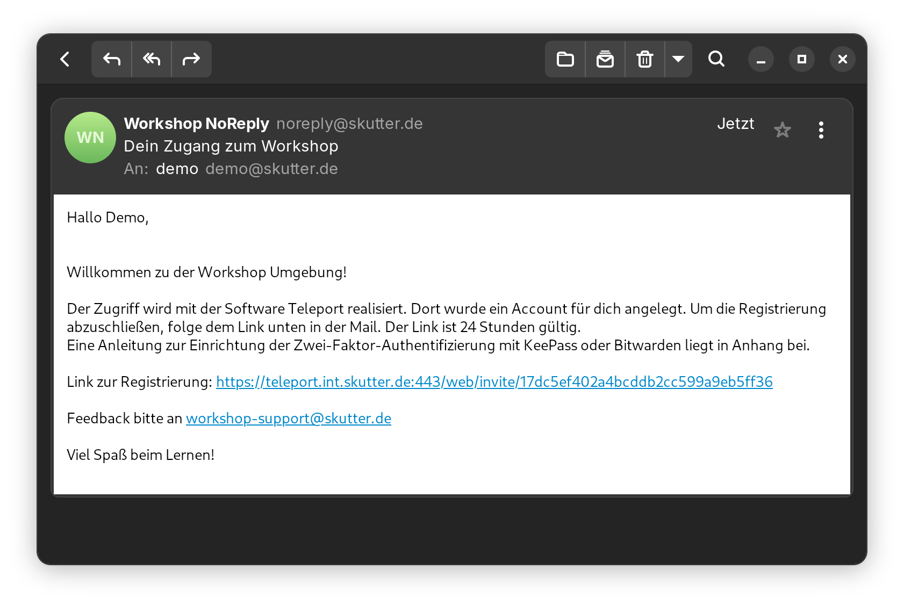
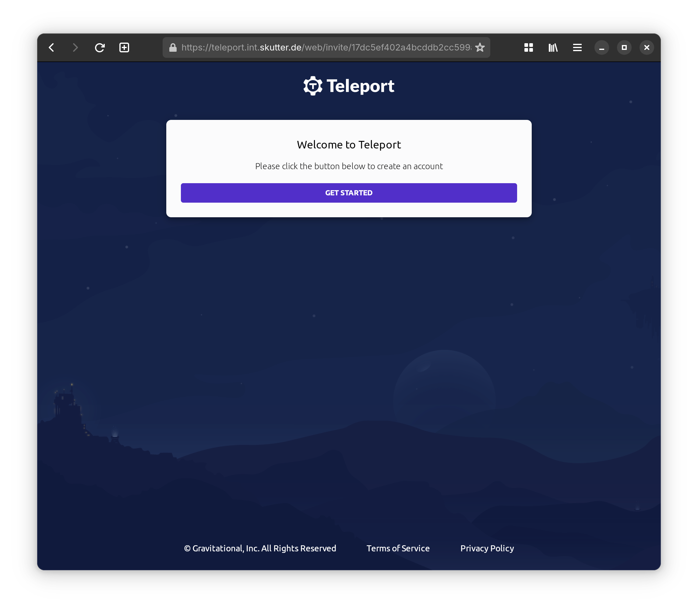
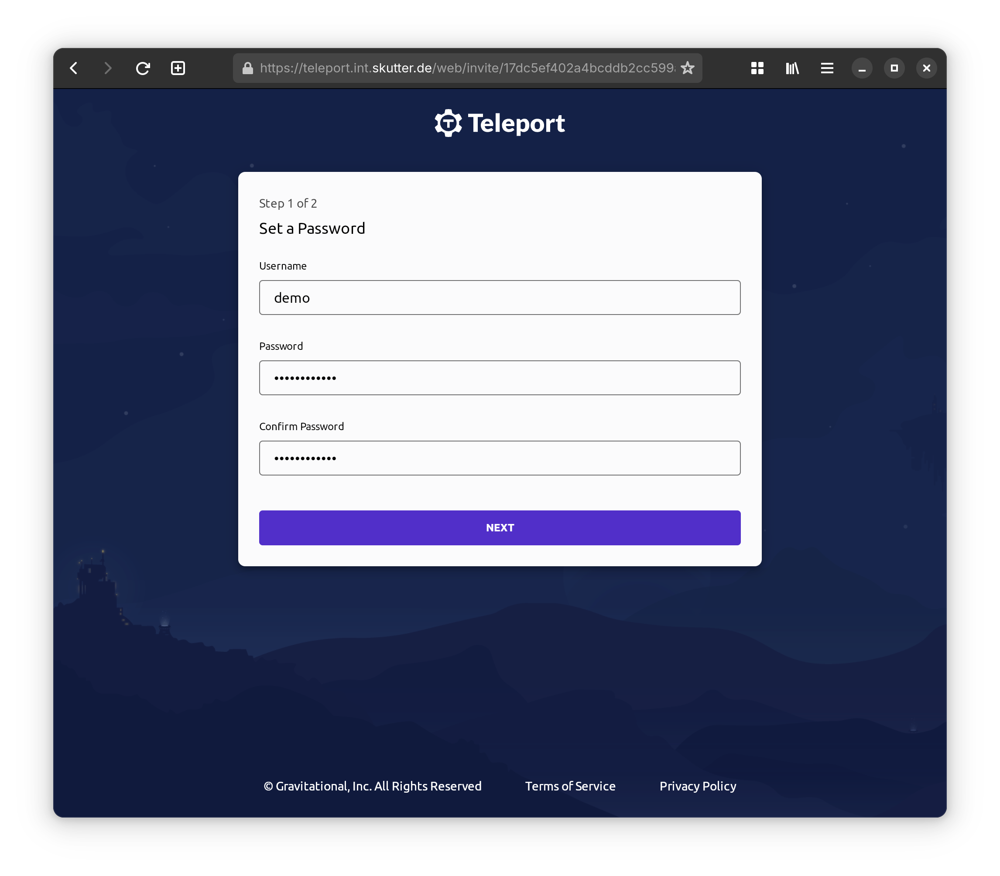

# Einleitung

Herzlich Willkommen im Ansible-Workshop. Hier sollen dir die Grundzüge von Ansible näher gebracht werden.

## Aufbau der Workshop-Umgebung

```mermaid
architecture-beta
    group lab
    service computer(fa6-solid:laptop-code)
    service teleport(fa6-solid:shield-halved)[Teleport]
    service bastion(fa6-solid:house-chimney)[Bastion Host] in lab
    service git(fa6-solid:server)[Git Server] in lab
    service vault(fa6-solid:server)[Vaultwarden Server] in lab
    service router(fa6-solid:network-wired)[Router] in lab

    junction labnetworkcenter in lab
    junction labnetworktop in lab
    junction labnetworkbottom in lab

    computer:B --> T:teleport 
    teleport:R --> L:router
    router:R -- L:labnetworkcenter
    labnetworkcenter:T -- B:labnetworktop
    labnetworkcenter:B -- T:labnetworkbottom
    labnetworktop:R -- L:bastion
    labnetworkcenter:R -- L:git
    labnetworkbottom:R -- L:vault
```

| Host               | Beschreibung     | Hostname (FQDN)      | IP-Adresse     |
| :----------------- | :--------------- | :------------------- | :------------- |
| Bastion Host       | Admin Maschine   | bastion.lab.internal | 192.168.100.10 |
| Git Server         | Gitea Server     | git.lab.internal     | 192.168.100.11 |
| Vaultwarden Server | Passwort Manager | vault.lab.internal   | 192.168.100.12 |

Der Zugriff auf die Umgebung ist mit Teleport realisiert. Dazu wird ein Account benötigt, die Daten dazu solltest du in so einer E-Mail erhalten haben:

## Ziel des Workshops

1. Grundverständnis von Ansible
   1. Gitea als Binary Installation auf "Git Server"
   2. Vaultwarden Installation per Docker Compose auf "Vaultwarden Server"

1.
Das Ziel dieses Workshops soll es sein, ein grundlegendes Grundverständnis von Ansible zu vermitteln. Dabei soll klar werden, für welche Zwecke Ansible genutzt werden kann und welche Vorteile es bietet.
Im Einzelnen bedeutet das:
    - Was ist Ansible?
        Eine kurze Einführung in Ansible, inklusive einer Erklärung der Grundkonzepte wie Playbooks, Rollen und Inventories
    - Warum?
        Darstellung der Vorteile von Ansible; Automatisierung, Orchestrierung innerhalb einer IT-Infrastruktur und Wiederholbarkeit
    - Grundlegende Nutzung
        Beispielhafte Playbooks anhand von UNIX Systemen

2. Gitea als Binary Installation auf einem GIT Server einrichten
    - kurze Einführung zu GIT
    - Voraussetzungen
    - Download
    - Installation
    - Konfiguration
    - Starten
    - Security (?)

3.Installation von Vaultwarden per Docker Compose auf dem "Vaultwarden Server"
    - Voraussetzungen
    - Einrichtung von Docker Compose (docker-compose.yml)
        -Vaultwarden + db
    - Security (?)
    - Backup (?)

### Keepass

1. Bild QR Code speichern
2. Hochladen auf https://scanqr.org/
3. 