# Einleitung

Herzlich Willkommen im Ansible-Workshop. Hier sollen dir die Grundzüge von Ansible näher gebracht werden.

## Aufbau der Workshop-Umgebung

```mermaid
architecture-beta
    group lab
    service computer(fa6-solid:laptop-code)
    service teleport(fa6-solid:shield-halved)[Teleport]
    service bastion(fa6-solid:house-chimney)[Bastion Host] in lab
    service git(fa6-solid:server)[Git Server] in lab
    service vault(fa6-solid:server)[Vaultwarden Server] in lab
    service router(fa6-solid:network-wired)[Router] in lab

    junction labnetworkcenter in lab
    junction labnetworktop in lab
    junction labnetworkbottom in lab

    computer:B --> T:teleport 
    teleport:R --> L:router
    router:R -- L:labnetworkcenter
    labnetworkcenter:T -- B:labnetworktop
    labnetworkcenter:B -- T:labnetworkbottom
    labnetworktop:R -- L:bastion
    labnetworkcenter:R -- L:git
    labnetworkbottom:R -- L:vault
```

| Host               | Beschreibung     | Hostname (FQDN)      | IP-Adresse     |
| :----------------- | :--------------- | :------------------- | :------------- |
| Bastion Host       | Admin Maschine   | bastion.lab.internal | 192.168.100.10 |
| Git Server         | Gitea Server     | git.lab.internal     | 192.168.100.11 |
| Vaultwarden Server | Passwort Manager | vault.lab.internal   | 192.168.100.12 |

Der Zugriff auf die Umgebung ist mit Teleport realisiert. Dazu wird ein Account benötigt, die Daten dazu solltest du in so einer E-Mail erhalten haben:

## Ziel des Workshops

1. Das Ziel dieses Workshops soll es sein, ein grundlegendes Grundverständnis von Ansible zu vermitteln. Dabei soll klar werden, für welche Zwecke Ansible genutzt werden kann und welche Vorteile es bietet.

    Im Einzelnen bedeutet das:

    - Was ist Ansible?
        Eine kurze Einführung in Ansible, inklusive einer Erklärung der Grundkonzepte wie Playbooks, Rollen und Inventories
    - Warum?
        Darstellung der Vorteile von Ansible; Automatisierung, Orchestrierung innerhalb einer IT-Infrastruktur und Wiederholbarkeit
    - Grundlegende Nutzung von Ansible
        Beispielhafte Playbooks anhand von UNIX Systemen

2. Gitea als Binary Installation auf einem GIT Server einrichten

    Die Aufgabe besteht darin, die Versionsverwaltungsplattform Gitea auf einem dedizierten „Git Server“ als Binary zu installieren. Ziel ist es, selbst einen GIT Server für eine Speicherung der Repositories bereitzustellen . Hierbei wird auf eine manuelle, direkt über die Kommandozeile gesteuerte Installation gesetzt, die mittels der Dokumentation unterstützt wird.

        Vorbereitung des Servers: 
            Sicherstellen, dass der Server über die notwendigen Voraussetzungen verfügt (z.B. ausreichender Speicherplatz, korrektes Betriebssystem, Nutzerrechte etc.).
        Download und Installation der Gitea Binary: 
            Schritt-für-Schritt-Anleitung zur Installation von Gitea als Binary.
        Konfiguration von Gitea: 
            Nach der Installation muss Gitea entsprechend konfiguriert werden (z.B. Konfiguration von Benutzerrechten, Repository-Pfaden und Netzwerkeinstellungen).
        Starten des Gitea-Dienstes: 
            Einrichtung des Dienstes, sodass Gitea nach einem Server-Neustart automatisch gestartet wird.
        
        Absicherung des Servers: 
            Implementierung von Sicherheitsmaßnahmen wie der Absicherung der Kommunikation über SSL (HTTPS).

3. Installation von Vaultwarden per Docker Compose auf dem "Vaultwarden Server"
    Die Aufgabe besteht darin, Vaultwarden, eine leichtgewichtige und Self-Hosted Version des Passwortmanagers Bitwarden, auf einem dedizierten „Vaultwarden Server“ mittels Docker Compose zu installieren. Ziel ist es, eine sichere und zuverlässige Passwortverwaltungsplattform bereitzustellen, die über eine einfache Weboberfläche oder per Handy-App zugänglich ist.

        Vorbereitung des Servers: 
            Installation von Docker und Docker Compose sowie Sicherstellung, dass die nötigen Systemvoraussetzungen für den Betrieb von Vaultwarden erfüllt sind.
        Einrichtung von Docker Compose: 
            Erstellen einer docker-compose.yml-Datei, die die Container für Vaultwarden und gegebenenfalls eine dazugehörige Datenbank (z.B. SQLite, MySQL, oder PostgreSQL) definiert.
        Starten von Vaultwarden: 
            Starten des Docker Compose Stacks und Überprüfung, dass der Dienst korrekt läuft.
        Absicherung des Systems: 
            Implementierung von Sicherheitsmaßnahmen, wie etwa die Nutzung eines Reverse Proxy (z.B. NGINX) mit SSL-Verschlüsselung, um eine sichere Verbindung zur Weboberfläche von Vaultwarden zu gewährleisten.
        
        Backup- und Wiederherstellungsstrategie: 
            Erstellung eines Plans für regelmäßige Backups der Vaultwarden-Datenbank und Anleitung zur Wiederherstellung im Fehlerfall.

### Keepass

1. Bild QR Code speichern
2. Hochladen auf https://scanqr.org/
3. 