# Einleitung

Herzlich Willkommen im Ansible-Workshop. Hier sollen dir die Grundzüge von Ansible näher gebracht werden.

## Ziel des Workshops

Das Ziel dieses Workshops soll es sein, ein grundlegendes Verständnis von Ansible zu vermitteln. Dabei soll klar werden, für welche Zwecke Ansible genutzt werden kann und welche Vorteile es bietet. Hierbei steht die praktische Anwendung im Vordergrund, die Theorie spielt eine nachrangige Rolle. Mit zunehmender Erfahrung in der Anwendung erschließt du dir immer mehr Tricks und technische Feinheiten.

## Aufbau der Workshop-Umgebung

```mermaid
architecture-beta
    group lab
    service computer(fa6-solid:laptop-code)
    service teleport(fa6-solid:shield-halved)[Teleport]
    service bastion(fa6-solid:house-chimney)[Bastion Host] in lab
    service git(fa6-solid:server)[Git Server] in lab
    service vault(fa6-solid:server)[Vaultwarden Server] in lab
    service router(fa6-solid:network-wired)[Router] in lab

    junction labnetworkcenter in lab
    junction labnetworktop in lab
    junction labnetworkbottom in lab

    computer:B --> T:teleport 
    teleport:R --> L:router
    router:R -- L:labnetworkcenter
    labnetworkcenter:T -- B:labnetworktop
    labnetworkcenter:B -- T:labnetworkbottom
    labnetworktop:R -- L:bastion
    labnetworkcenter:R -- L:git
    labnetworkbottom:R -- L:vault
```

Du erhältst Zugriff auf ein eigenes, kompaktes Netzwerk, das als Beispiel für ein kleines Homelab oder eine Testumgebung dient. Die Umgebung ist auf das Wesentliche reduziert, um eine optimale Lernumgebung zu schaffen. Dienste, die in größeren Netzwerken häufig anzutreffen sind, wie Internet-Proxys, Logging-Server, Monitoring-Systeme oder Mirror-Server für Repositories, sind hier jedoch nicht enthalten.

Das Netzwerk besteht aus folgenden Maschinen und Diensten:

Der Bastion Host ist die Maschine, die für Entwicklungs- und Administationszwecke verwendet wird. Oftmals stehen Bastion Hosts in einer so genannten [DMZ (demilitarisierten Zone)](https://de.wikipedia.org/wiki/Demilitarisierte_Zone_(Informatik)). Aufgrund der hohen Komplexität wurde in diesem Fall bewusst auf die Implementierung einer DMZ verzichtet.

Im Rahmen des Workshops wird auf dem Git-Server die Software Gitea installiert. Dieser Server dient als Zielsystem für Ansible.

Wenn du den Workshop zügig durcharbeitest, kannst du auf dem Vaultwarden-Server den Passwortmanager Vaultwarden installieren. Auch dieser Server dient als Zielsystem für Ansible.

Hier sind nochmal alle Server mit FQDN und IP-Adresse aufgeführt:

| Host               | Beschreibung     | Hostname (FQDN)      | IP-Adresse     |
| :----------------- | :--------------- | :------------------- | :------------- |
| Bastion Host       | Admin Maschine   | bastion.lab.internal | 192.168.100.10 |
| Git Server         | Gitea Server     | git.lab.internal     | 192.168.100.11 |
| Vaultwarden Server | Passwort Manager | vault.lab.internal   | 192.168.100.12 |

Der Zugriff auf die Umgebung ist mit Teleport realisiert. Dazu wird ein Account benötigt, die Daten dazu solltest du in so einer E-Mail erhalten haben:

## Unterteilung des Workshops

### Arbeiten mit Visual Studio Code

Zu Beginn werden dir einige grundlegende Aspekte zur Arbeit mit dem Editor Visual Studio Code (oder der Web-Variante Code-Server) vermittelt. Dies soll dir den Umgang erleichtern und die Bearbeitung der Aufgaben unterstützen.

### 1. [Ansible-Grundlagen](Ansible_Grundlagen.md)

Bevor wir mit den Aufgaben starten, erhältst du hier eine Einführung in die wichtigsten Grundlagen. Von einem Überblick über die Verzeichnisstruktur und dem Umgang mit der Ansible-Dokumentation bis hin zum Erstellen deines ersten Playbooks findest du hier alles, was dir den Einstieg erleichtert. Dieses Kapitel dient dir während der Aufgaben zudem als Nachschlagewerk, falls du bestimmte Inhalte auffrischen oder die genaue Syntax überprüfen möchtest.

### 2. [Aufgabe: Installation von Gitea](Gitea/Intro.md)

In dieser ersten Aufgabe wirst du die Installation der Quellcodeverwaltungssoftware Gitea automatisieren. Obwohl die Installation an sich recht einfach ist, umfasst sie genügend Schritte, um eine Automatisierung sinnvoll zu gestalten. Zwar wäre eine manuelle Installation schneller (bei mir etwa 10 Minuten im Vergleich zu rund 45 Minuten für die Automatisierung), jedoch liegt der Hauptnutzen der Automatisierung nicht allein im Zeitaufwand. Vielmehr bietet sie Vorteile wie Wiederholbarkeit, Konsistenz und Skalierbarkeit, die gerade in größeren oder komplexeren Umgebungen unverzichtbar sind.

### 3. [Aufgabe: Installation von Vaultwarden](Vaultwarden/Intro.md)

Wenn du noch genügend Zeit hast oder diese Aufgabe später angehen möchtest, kannst du als zweite Aufgabe die Installation des Passwortmanagers Vaultwarden automatisieren. Die Installation erfolgt in diesem Fall über einen Docker-Container mit Docker Compose. Das erstellte Playbook sowie die zugehörigen Daten kannst du problemlos auf einen anderen Server übertragen, um dir eine eigene Vaultwarden-Instanz bereitzustellen. Da viele Softwarelösungen per Docker Compose installiert werden, kannst du den erstellten Code und das erworbene Wissen auch in anderen Projekten wiederverwenden. Vaultwarden bietet hierfür ein einfaches, aber äußerst nützliches Beispiel.

---

 
 

> [!CAUTION]
> *Here be dragons!* Alles ab hier ist noch im Aufbau. Wenn du das nach Fertigstellung machen möchtest, melde dich gerne bei mir!

### Eine ganze Umgebung mit nur einem Befehl

Nachdem wir einige Beispiele fertig automatisiert haben, wird es Zeit, das ganze zu einem Gesamtbild zusammenzufügen. Durch die Möglichkeit, Playbooks in andere Playbooks zu importieren, schreibst du hier ein Playbook `site.yml`, mit dem du die ganze Umgebung mit einem einzigen Befehl steuern kannst.

### Integration mit Git

Eine nützliche Möglichkeit, die die Nutzung von Git (mit Gitea, Gitlab, GitHub, o.ä.) bietet, ist die automatisierte Ausbringung der Umgebung bei Änderungen mittels einer CI/CD Pipeline. Hierzu wird in diesem Kapitel die Installation und Konfiguration des Dienstes, der die CI/CD Pipelines ausführt, Act Runner, in das bestehende Playbook zur Gitea-Installation integriert. Danach erstellt du eine Pipeline, um bei Änderungen an den Playbooks das Deployment automatisch durchzuführen.
