# Einleitung

Herzlich Willkommen im Ansible-Workshop. Hier sollen dir die Grundzüge von Ansible näher gebracht werden.

## Ziel des Workshops

Das Ziel dieses Workshops soll es sein, ein grundlegendes Verständnis von Ansible zu vermitteln. Dabei soll klar werden, für welche Zwecke Ansible genutzt werden kann und welche Vorteile es bietet. Hierbei steht die praktische Anwendung im Vordergrund, die Theorie spielt hier nur eine nachrangige Rolle. Viele Tricks und technische Details lernt man mit wachsender Erfahrung in der Anwendung.

## Aufbau der Workshop-Umgebung

```mermaid
architecture-beta
    group lab
    service computer(fa6-solid:laptop-code)
    service teleport(fa6-solid:shield-halved)[Teleport]
    service bastion(fa6-solid:house-chimney)[Bastion Host] in lab
    service git(fa6-solid:server)[Git Server] in lab
    service vault(fa6-solid:server)[Vaultwarden Server] in lab
    service router(fa6-solid:network-wired)[Router] in lab

    junction labnetworkcenter in lab
    junction labnetworktop in lab
    junction labnetworkbottom in lab

    computer:B --> T:teleport 
    teleport:R --> L:router
    router:R -- L:labnetworkcenter
    labnetworkcenter:T -- B:labnetworktop
    labnetworkcenter:B -- T:labnetworkbottom
    labnetworktop:R -- L:bastion
    labnetworkcenter:R -- L:git
    labnetworkbottom:R -- L:vault
```

Du bekommst Zugriff auf ein eigenes kleines Netzwerk. So kann bspw. ein kleines Homelab oder eine Testumgebung aussehen. Die Umgebung ist auf das wesentliche beschränkt, um eine sinnvolle Umgebung zum Lernen zu bieten. Viele Dienste, die in großen Umgebungen üblich sind (Internetproxy, Loggingserver, Monitoring, Mirror-Server für Repositories, etc.), sind hier allerdings nicht vorhanden.

Das Netzwerk besteht aus folgenden Maschinen und Diensten:

Der Bastion Host ist die Maschine, die für Entwicklungs- und Administationszwecke verwendet wird. Oftmals stehen Bastion Hosts in einer so genannten [DMZ (demilitarisierten Zone)](https://de.wikipedia.org/wiki/Demilitarisierte_Zone_(Informatik)). Hier wurde allerdings, aufgrund der hohen Komplexität, auf eine DMZ verzichtet.

Auf dem Git Server wird im Rahmen des Workshops die Software Gitea installiert. Er stellt ein Zielsystem für Ansible dar.

Auf dem Vaultwarden Server wird, bei ausreichender Zeit, der Passwortmanager Vaultwarden installiert. Auch dieser Server stellt ein Zielsystem für Ansible dar.

Hier sind nochmal alle Server mit FQDN und IP-Adresse aufgeführt:

| Host               | Beschreibung     | Hostname (FQDN)      | IP-Adresse     |
| :----------------- | :--------------- | :------------------- | :------------- |
| Bastion Host       | Admin Maschine   | bastion.lab.internal | 192.168.100.10 |
| Git Server         | Gitea Server     | git.lab.internal     | 192.168.100.11 |
| Vaultwarden Server | Passwort Manager | vault.lab.internal   | 192.168.100.12 |

Der Zugriff auf die Umgebung ist mit Teleport realisiert. Dazu wird ein Account benötigt, die Daten dazu solltest du in so einer E-Mail erhalten haben:

## Unterteilung des Workshops

### Arbeiten mit Visual Studio Code

Als erstes werden dir einige grundlegende Dinge zu der Arbeit mit dem Editor, Visual Studio Code (bzw. der Web-Variante code-server), erklärt. Hierdurch soll dir der Umgang und die Bearbeitung der Aufgaben etwas erleichtert werden.

### Ansible-Grundlagen

Bevor wir mit den Aufgaben beginnen, werden dir hier einige Grundlagen vermittelt. Von einem Überblick der Verzeichnisstruktur, über das Lesen der Ansible-Dokumentation bishin zum Schreiben des ersten Playbooks ist hier alles zu finden, um dir einen schnellen Einstieg zu ermöglichen. Im Laufe der Aufgaben kannst du dieses Kapitel auch referenzieren, wenn du dir Dinge nochmal in Erinnerung rufen oder dir die genaue Syntax möchtest.

### Installation von Gitea

In dieser ersten Aufgabe sollst du die Installation der Quellcodeverwaltungssoftware Gitea automatisieren. Die Installation der Software ist recht einfach, aber hat trotzdem genug Schritte, um eine automatisierte Installation empfehlenswert zu machen. Eine händische Installation wäre natürlich schneller als die Automatisierung (für mich ca. 10 Minuten vs. ca. 45 Minuten), allerdings ist der reine Zeitaufwand für die Installation nicht der Hauptgrund, der eine Automatisierung sinnvoll macht.

### Installation von Vaultwarden

Wenn du noch genug Zeit hast, oder das zu einem anderen Zeitpunkt machen möchtest, kannst du hier als zweite Aufgabe die Installation des Passwortmanager Vaultwarden automatisieren. Die Installation erfolgt hier als Docker-Container mit Docker Compose. Das Playbook, oder auch die Daten kannst du ganz einfach zu einem eigenen Server mitnehmen und dir damit deine eigene Vaultwarden-Instanz deployen. Viel Software wird per Docker Compose installiert, daher kann man auch viel von dem Code und dem Wissen weiter verwenden. Vaultwarden ist hier ein sehr einfaches (und nützliches!) Beispiel.

---

 
 

> [!CAUTION]
> *Here be dragons!* Alles ab hier ist noch im Aufbau. Wenn du das nach Fertigstellung machen möchtest, melde dich gerne bei mir!

### Eine ganze Umgebung mit nur einem Befehl

Nachdem wir einige Beispiele fertig automatisiert haben, wird es Zeit, das ganze zu einem Gesamtbild zusammenzufügen. Durch die Möglichkeit, Playbooks in andere Playbooks zu importieren, schreibst du hier ein Playbook `site.yml`, mit dem du die ganze Umgebung mit einem einzigen Befehl steuern kannst.

### Integration mit Git

Eine nützliche Möglichkeit, die die Nutzung von Git (mit Gitea, Gitlab, GitHub, o.ä.) bietet, ist die automatisierte Ausbringung der Umgebung bei Änderungen mittels einer CI/CD Pipeline. Hierzu wird in diesem Kapitel die Installation und Konfiguration des Dienstes, der die CI/CD Pipelines ausführt, Act Runner, in das bestehende Playbook zur Gitea-Installation integriert. Danach erstellt du eine Pipeline, um bei Änderungen an den Playbooks das Deployment automatisch durchzuführen.
