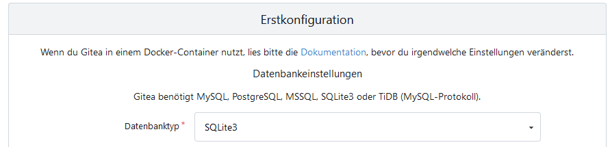
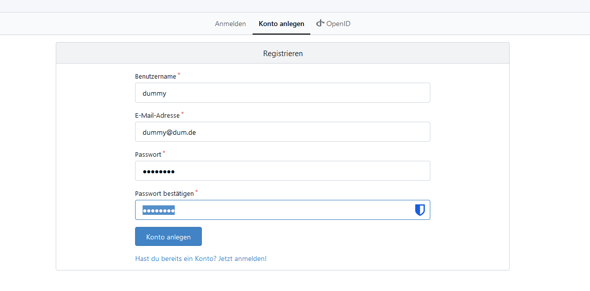
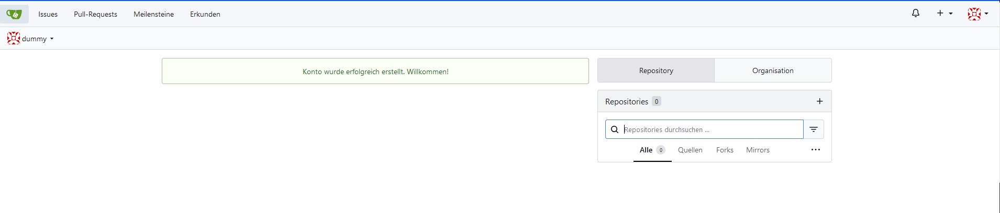

# Manuelle Installation

Auf dieser Seite wird die manuelle Installation von Gitea per Binary beschrieben. Dies soll ein Leitfaden für die Erstellung des Ansible-Skripts sein.


### User und Gruppe für Gitea anlegen

Gitea läuft unter einem eigenen User (`git`). Dieser User muss mit seiner Gruppe durch dich angelegt werden. Das geht mit folgendem Befehl:

```shell
# Gruppe anlegen
groupadd --system git

# User anlegen
useradd \
   --system \
   --shell /bin/bash \
   --comment 'Git Version Control' \
   --gid git \
   --home-dir /home/git \
   --create-home \
   git
```

Für das Anlegen der Gruppe kannst du das Ansible-Modul [ansible.builtin.group](https://docs.ansible.com/ansible/latest/collections/ansible/builtin/group_module.html) und für das Anlegen des Users das Module [ansible.builtin.user](https://docs.ansible.com/ansible/latest/collections/ansible/builtin/user_module.html) verwenden.


### Erstellung der Verzeichnisstruktur für Gitea
Es müssen für die Installation mehrere Verzeichnisse angelegt werden.
1. Unter `/var/lib/gitea` sollen die Verzeichnisse custom, data und log angelegt werden.
2. Owner und Group für die Verzeichnisse setzen.
3. Die Berechtigungen setzen
```shell
mkdir -p /var/lib/gitea/{custom,data,log}
chown -R git:git /var/lib/gitea/
chmod -R 750 /var/lib/gitea/
```

4. Den Ordner `/etc/gitea` erstellen
5. Ownership auf root:git und Berechtigung auf 770 stellen

```shell
mkdir /etc/gitea
chown root:git /etc/gitea
chmod 770 /etc/gitea
```

Für das Anlegen von Verzeichnissen und Setzen der entsprechenden Ownerships/Berechtigungen kann das Ansible-Modul [ansible.builtin.file](https://docs.ansible.com/ansible/latest/collections/ansible/builtin/file_module.html) verwendet werden.

Das Modul kann allerdings nur ein Pfad gleichzeitig verwendet werden. 
Daher ist empfohlen, für custom, data, log eine Schleife zu verwenden und /etc/gitea in einem eigenen Task zu behandeln.


### Herunterladen und ablegen der Gitea Binary
Die Gitea Binary muss auf das System heruntergeladen werden und an einen globalen Ort mit frei zugänglichen Rechten hinterlegt werden.
1. Herunterladen der Gitea-Binary:
```shell
wget -O gitea https://dl.gitea.com/gitea/1.22.3/gitea-1.22.3-linux-amd64
chmod +x gitea
```
2. Kopieren in ein globales Verzeichnis
```shell
cp gitea /usr/local/bin/gitea
```

Für das herunterladen und ablegen der Datei auf den Zielsystemen kann das Ansible Modul [ansible.builtin.get_url](https://docs.ansible.com/ansible/latest/collections/ansible/builtin/get_url_module.html) verwendet werden. Wichtig ist, dass in diesem Modul ebenfalls owner, group und mode festgelegt werden können.


### Gitea starten
Wie erwähnt, gibt es 2 Wege um Gitea zu starten.
1. Ausführen von der CLI:
```shell
GITEA_WORK_DIR=/var/lib/gitea/ /usr/local/bin/gitea web -c /etc/gitea/app.ini
```
2. Erstellen einer .service Datei um Gitea automatisch zu starten. Hierfür verwenden wir folgendes Grundschema: [gitea.service](https://github.com/go-gitea/gitea/blob/release/v1.22/contrib/systemd/gitea.service)

```ini
{{#include gitea.service}}
```
Danach über die CLI auszuführen:

```shell
sudo systemctl enable gitea
sudo systemctl start gitea
```

Das Ausführen per CLI ist durch [ansible.builtin.command](https://docs.ansible.com/ansible/latest/collections/ansible/builtin/command_module.html) Module realisierbar, allerdings nicht erstrebenswert für eine automatisierte Umgebung. 

Um mittels Ansible die .service Datei auf die Zielsysteme einzuspielen, empfehlen wir das [ansible.builtin.copy](https://docs.ansible.com/ansible/latest/collections/ansible/builtin/copy_module.html) Module. Dies setzt allerdings voraus, dass eine entsprechende .service Datei auf der Control-Node vorhanden ist.

Zuletzt kann mithilfe des [ansible.builtin.systemd_service](https://docs.ansible.com/ansible/latest/collections/ansible/builtin/systemd_service_module.html) der Systemd Prozess aktiviert und der Daemon reloaded werden.


### Ausführen des First-Install Wizards von Gitea

Bei Teleport gibt es eine "Kachel" mit dem Namen: **gitea-username**. Dort soll nun der "Launch-Button" gedrückt werden.


Es öffnet sich der Install Wizard von Gitea. Bitte hier **SQLite3** als Datenbank auswählen! Alle anderen Einstellungen sollten auf Standard bleiben. Mit einem Click auf "Erstellen" geht es weiter.



Von dem Reiter "Anmelden" auf "Konto erstellen" wechseln und dort den Admin User registrieren.

 

Herzlichen Glückwunsch, die Installation von Gitea ist fertig!



Damit ist die manuelle Installation abgeschlossen!