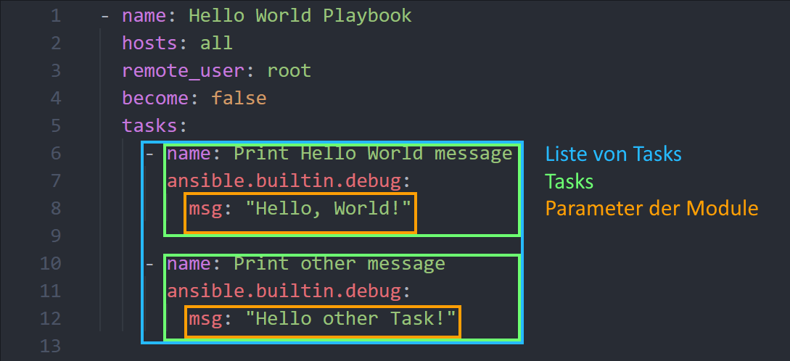

# Hello World! Dein erstes Playbook

Auf dieser Seite lernst du, ein einfaches Ansible-Playbook zu erstellen und auszuführen. Dieses Playbook gibt eine "Hello-World"-Nachricht auf jedem Host aus, den du in deinem Inventory definiert hast.

Dafür erstellst du nun eine Datei namens **hello-world.yml** in ??? und fügst folgendes Playbook ein.

### Hello-World Playbook

```yaml
- name: Hello World Playbook  # Name des gesamten Plays
  hosts: all                  # Definiert, auf welche Hosts dieses Playbook angewendet wird
  remote_user: root           # es soll sich als root user auf den Zielsystem authorisiert werden
  become: false               # Erlaubt die Ausführung von Aufgaben mit erhöhten Rechten (root)
  tasks:                      # Liste der Aufgaben, die auf den Hosts ausgeführt werden sollen
    - name: Print Hello World message
      ansible.builtin.debug:  # Ansible-Modul "debug", das eine Nachricht ausgibt
        msg: "Hello, World!"  # Die Nachricht, die angezeigt werden soll
```

**name:** Ein Name für das Playbook, mit den Zweck das Playbook zu erkennen.

**hosts:** Gibt die Hosts an, auf denen das Playbook ausgeführt werden soll. Hier verwenden wir ***all***

**remote_user:** Hier legst du fest, mit welchem User du dich auf die Zielsysteme verbindest.

**become:** Führt die Aufgaben mit erhöhter Berechtigung aus. Wenn du dich nicht als ***root*** anmeldest, muss hier **true** gesetzt werden!

**tasks:** Hier werden die Aufgaben definiert, die in diesem Playbook ausgeführt werden sollen. In unserem Fall soll das Debug-Modul die "Hello-World" Nachricht ausgeben.

#### Taskstruktur

In dem folgenden Bild ist die Struktur der Tasks farblich hervorgehoben:



`tasks` ist eine Liste (YAML Liste) von einzelnen Tasks (YAML dictionary). Ein Task besteht aus mehreren Parametern, meistens der Name (`name`), das Modul (hier im Beispiel `ansible.builtin.debug`) und ggf. Bedingungen (`when`) oder Schleifen (`loop`). Die Module haben zusätzlich eigene Parameter. Diese lassen sich durch die Einrückung von den Parametern des Tasks unterscheiden.

Eine genaue Erklärung der Syntax ist in der [Ansible Dokumentation](https://docs.ansible.com/ansible/latest/reference_appendices/YAMLSyntax.html) zu finden.

### Ausführung des Playbooks

Nun kannst du das Playbook ausführen. Verwende dafür den folgenden Befehl:

``` shell
ansible-playbook -i inventory/inventory.yml hello-world.yml
```

### Ausgabe des Playbooks

Anbei ist die Ausgabe, welche durch das Playbook erzeugt wird.

```
PLAY [Hello World Playbook] ********************************************************************************************************************************************************************

TASK [Gathering Facts] *************************************************************************************************************************************************************************
[WARNING]: Platform linux on host git.lab.internal is using the discovered Python interpreter at /usr/bin/python3.9, but future installation of another Python interpreter could change the
meaning of that path. See https://docs.ansible.com/ansible-core/2.18/reference_appendices/interpreter_discovery.html for more information.
ok: [git.lab.internal]
[WARNING]: Platform linux on host vault.lab.internal is using the discovered Python interpreter at /usr/bin/python3.9, but future installation of another Python interpreter could change the
meaning of that path. See https://docs.ansible.com/ansible-core/2.18/reference_appendices/interpreter_discovery.html for more information.
ok: [vault.lab.internal]

TASK [Print Hello World message] ***************************************************************************************************************************************************************
ok: [git.lab.internal] => {
    "msg": "Hello, World!"
}
ok: [vault.lab.internal] => {
    "msg": "Hello, World!"
}

PLAY RECAP *************************************************************************************************************************************************************************************
git.lab.internal           : ok=2    changed=0    unreachable=0    failed=0    skipped=0    rescued=0    ignored=0   
vault.lab.internal         : ok=2    changed=0    unreachable=0    failed=0    skipped=0    rescued=0    ignored=0   
```


#### **Damit hast du erfolgreich dein erstes Ansible-Playbook geschrieben und ausgeführt. Dies ist eine gute Grundlage um die folgenden Aufgaben dieses Labs zu verstehen und zu meistern!**