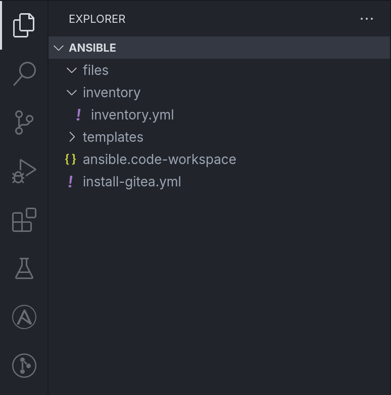

# Verzeichnisstruktur

Eine typische Verzeichnisstruktur für Ansible-Projekte folgt einem standardisierten Aufbau, der dabei hilft, Konfigurationsdateien, Playbooks, Variablen, und Rollen übersichtlich zu organisieren.

In deinem VS Code unter dem "Explorer"-Panel siehst du folgende Struktur: 



Hier ist die Verzeichnisstruktur erneut als Baum dargestellt und mit Kommentaren versehen:

```
ansible/
├── ansible.cfg                     # Ansible-Konfigurationsdatei(optional)
├── files/                          # Enthält statische Dateien
│   └── gitea.service               # Beispieldatei, die für die Konfiguration von Gitea genutzt wird
├── inventory/                      
│   └── inventory.yml               # Inventory-Datei mit definierten Hosts und Gruppen
├── tasks/                          # Aufgaben, die in Playbooks aufgerufen werden können
├── templates/                      # Jinja2-Templates für dynamischen Aufruf innerhalb eines Plays
├── install-gitea.yml               
├── install-vaultwarden.yml
├── README.md
└── site.yml                        # Haupt-Playbook zur Ausführung der gesamten Site-Konfiguration
```


### Erklärung

**ansible.cfg:** Konfigurationsdatei, welche ansible-spezifische Einstellungen enthält. In diesem Vault, wird diese nicht in dem betrachteten Verzeichnis benötigt.

**files:** Das Verzeichnis entält statische Dateien, wie z.B. die "gitea.service" Datei. Diese können unverändert auf die entsprechenden Hosts kopiert werden.

**inventory:** Hier liegt die "inventory.yml", welche alle Hosts und Gruppen definiert, die für unser Lab verwaltet werden sollen.

**tasks:** Ein Verzeichnis, in welchem spezifische Aufgaben enthalten sein können, die in verschiedenen Playbooks verwendet werden.

**templates:** In diesem Verzeichnis können Jinja2-Templates abgelegt werden, mit dem Ziel Konfigurationsdateien mithilfe von Variablen dynamisch zu erstellen.

**\*\.yml:** Hierbei handelt es sich um Zwei spezialisierte Playbooks für die Installation von Gitea und Vaultwarden.

**site.yml:** Das Haupt-Playbook, welches in der Regel alle wichtigen Schritte zur Konfiguration der Site umfasst.


Diese Struktur eignet sich gut für unser Lab, da hier nur wenig spezifische Services installiert werden und es bei Bedarf flexibel genug ist, um erweitert zu werden.