# Einleitung

## Aufbau der Lab-Umgebung

```mermaid
architecture-beta
    group lab
    service computer(fa6-solid:laptop-code)
    service teleport(fa6-solid:shield-halved)[Teleport]
    service bastion(fa6-solid:house-chimney)[Bastion Host] in lab
    service git(fa6-solid:server)[Git Server] in lab
    service vault(fa6-solid:server)[Vaultwarden Server] in lab
    service router(fa6-solid:network-wired)[Router] in lab

    junction labnetworkcenter in lab
    junction labnetworktop in lab
    junction labnetworkbottom in lab

    computer:B --> T:teleport 
    teleport:R --> L:router
    router:R -- L:labnetworkcenter
    labnetworkcenter:T -- B:labnetworktop
    labnetworkcenter:B -- T:labnetworkbottom
    labnetworktop:R -- L:bastion
    labnetworkcenter:R -- L:git
    labnetworkbottom:R -- L:vault
```

    

| Host               | Beschreibung     | Hostname (FQDN)      | IP-Adresse     |
| :----------------- | :--------------- | :------------------- | :------------- |
| Bastion Host       | Admin Maschine   | bastion.lab.internal | 192.168.100.10 |
| Git Server         | Gitea Server     | git.lab.internal     | 192.168.100.11 |
| Vaultwarden Server | Passwort Manager | vault.lab.internal   | 192.168.100.12 |